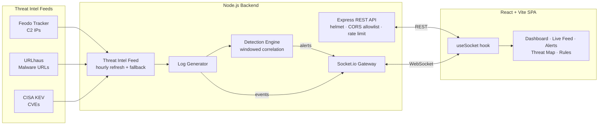

<div align="center">

# 🛡️ SentinelView

### Real-Time SIEM Dashboard with Live Threat Intelligence & MITRE ATT&CK Mapping

Stream, detect, and triage security events in real time — backed by live abuse.ch and CISA KEV feeds, correlated through a rules engine, and mapped to the MITRE ATT&CK framework.

[](https://github.com/BasitS-hash/siem-dashboard/actions/workflows/ci.yml)
[](https://github.com/BasitS-hash/siem-dashboard/actions/workflows/codeql.yml)
[](https://github.com/BasitS-hash/siem-dashboard/actions/workflows/security.yml)
[](LICENSE)
[](https://www.typescriptlang.org/)
[](https://react.dev/)
[](https://nodejs.org/)

</div>

---

## Overview

**SentinelView** is a full-stack Security Information and Event Management (SIEM) dashboard. A Node.js backend synthesizes a realistic stream of security events — blended with **real threat intelligence** pulled from public feeds — runs each event through a windowed detection engine, and pushes alerts to a React dashboard over WebSockets. Every alert is mapped to a MITRE ATT&CK tactic and technique, plotted on a live geographic threat map, and exportable to CSV.

It is built as a portfolio-grade demonstration of real-time data pipelines, threat-detection logic, secure API design, and modern TypeScript engineering — not a toy.

> **Why it's interesting:** the event stream isn't pure noise. Command-and-control IPs come from the **abuse.ch Feodo Tracker**, malware download URLs from **URLhaus**, and exploited-vulnerability references from the **CISA Known Exploited Vulnerabilities** catalog — so the dashboard reflects the live threat landscape.

---

## Features

### Detection & Intelligence
- **Real-time event stream** — Socket.io pushes log events and alerts to the browser with no polling.
- **Windowed detection engine** — stateful, per-source-IP correlation over sliding time windows with alert de-duplication.
- **Live threat intelligence** — hourly refresh from Feodo Tracker (C2 IPs), URLhaus (malware URLs), and CISA KEV (real CVEs), with graceful offline fallback.
- **MITRE ATT&CK mapping** — every alert carries a tactic, technique, and technique ID.
- **Geographic threat map** — source IPs geolocated and plotted in real time.
- **CSV export** — alerts and logs exportable with formula-injection-safe encoding.

### Detection Rules (MITRE ATT&CK Aligned)

| Rule | Trigger | MITRE ID | Severity |
|------|---------|----------|----------|
| Brute Force | ≥5 failed auths / 60s from one IP | T1110 | High |
| Port Scan | ≥8 unique ports / 60s from one IP | T1046 | High |
| SQL Injection | Any `sqli`-tagged request | T1190 | Critical |
| Cross-Site Scripting | Any `xss`-tagged request | T1059.007 | High |
| Data Exfiltration | >10 MB outbound in window | T1041 | Critical |
| Privilege Escalation | `sudo`/escalation indicators | T1548.003 | Critical |
| Reverse Shell / C2 | Reverse-shell or beacon indicators | T1071 | Critical |
| Lateral Movement | External IP contacting ≥5 internal hosts | T1021 | High |

### Dashboard
1. **Overview** — KPI cards, events-over-time area chart, severity donut, top attackers, category breakdown, recent alerts/logs.
2. **Live Feed** — scrolling event table with pause/resume, search, and severity/category filters.
3. **Alerts** — MITRE-badged alert cards with acknowledge/resolve workflow.
4. **Threat Map** — geolocated source IPs on a world map.
5. **Detection Rules** — rule catalog with thresholds, logic, and MITRE mapping.

---

## Architecture



**Data flow:** threat feeds seed the generator → events flow through the detection engine → alerts and events broadcast over Socket.io → the React client renders live state and supports acknowledge/resolve and CSV export.

---

## Tech Stack

| Layer | Technology |
|-------|-----------|
| Frontend | React 18, TypeScript 5, Vite 6 |
| Styling | Tailwind CSS 3 (dark cyber theme) |
| Charts | Recharts (area, pie, bar, radar) |
| Real-time | Socket.io |
| Backend | Node.js 20+, Express 4 |
| Security | helmet, express-rate-limit, CORS allowlist, startup env validation |
| Testing | Vitest (+ v8 coverage, jsdom) |
| Tooling | npm workspaces (monorepo), GitHub Actions, CodeQL, gitleaks, Dependabot |

---

## Quick Start

### Prerequisites
- Node.js 20+
- npm 10+

### Install & Run

```bash
git clone https://github.com/BasitS-hash/siem-dashboard.git
cd siem-dashboard

# Install all workspaces (frontend + backend)
npm install

# Optional: copy and adjust environment defaults
cp .env.example .env

# Run backend + frontend together
npm run dev
```

- **Frontend:** http://localhost:5200
- **Backend API:** http://localhost:3001
- **WebSocket:** ws://localhost:3001

### Production Build

```bash
npm run build      # builds frontend bundle + compiles backend
npm start          # serves the backend on port 3001
```

### Test & Verify

```bash
npm run test --workspace=backend     # 69 tests
npm run test --workspace=frontend    # 21 tests
npm run test:coverage --workspace=backend
npm run typecheck --workspace=backend
npm run typecheck --workspace=frontend
```

---

## Configuration

All configuration is via environment variables (see [`.env.example`](.env.example)):

| Variable | Scope | Default | Description |
|----------|-------|---------|-------------|
| `PORT` | Backend | `3001` | Server listen port (validated at startup) |
| `ALLOWED_ORIGINS` | Backend | `localhost:5200,3000` | Comma-separated CORS allowlist (no `*`) |
| `RATE_LIMIT_MAX` | Backend | `300` | Max `/api` requests per IP per minute |
| `VITE_BACKEND_URL` | Frontend | `localhost:3001` | Backend base URL (dev uses Vite proxy) |

Invalid values (e.g. a non-numeric port or a wildcard origin) cause the backend to fail fast at boot with a clear message.

---

## API Reference

### REST

| Method | Path | Description |
|--------|------|-------------|
| GET | `/api/health` | Health + threat-intel freshness |
| GET | `/api/logs?limit=200` | Recent events (limit clamped 1–500) |
| GET | `/api/alerts` | All alerts |
| GET | `/api/stats` | Current aggregate statistics |
| PATCH | `/api/alerts/:id` | Update alert status (validated id + status enum) |

### WebSocket Events (Server → Client)

| Event | Payload | Description |
|-------|---------|-------------|
| `init` | `{ logs, alerts, stats }` | Initial snapshot on connect |
| `log` | `LogEvent` | New security event |
| `alert` | `Alert` | New threat alert |
| `alert_updated` | `Alert` | Alert status change |
| `stats` | `Stats` | Aggregate stats (every 5s) |

---

## Project Structure

```
siem-dashboard/
├── backend/
│   └── src/
│       ├── index.ts             # Express + Socket.io server
│       ├── config.ts            # Env parsing & startup validation
│       ├── validation.ts        # Pure input validators
│       ├── threatDetector.ts    # Windowed detection engine + MITRE map
│       ├── threatIntelFeed.ts   # Feodo / URLhaus / CISA KEV ingestion
│       ├── logGenerator.ts      # Realistic event generator
│       ├── types.ts             # Shared types
│       └── *.test.ts            # Vitest suites
├── frontend/
│   └── src/
│       ├── pages/               # Dashboard, LiveFeed, Alerts, ThreatMap, Rules
│       ├── components/          # Charts, cards, table, header, sidebar
│       ├── hooks/               # useSocket, useToast
│       ├── lib/exportCsv.ts     # Injection-safe CSV export
│       └── lib/exportCsv.test.ts
├── .github/
│   ├── workflows/               # ci · codeql · security
│   └── dependabot.yml
├── SECURITY.md
├── CONTRIBUTING.md
└── package.json                 # npm workspaces root
```

---

## Screenshots

> _Placeholder — add captures of the Overview, Threat Map, and Alerts views here._

| Overview | Threat Map | Alerts |
|----------|-----------|--------|
| _coming soon_ | _coming soon_ | _coming soon_ |

---

## Security

Security posture, hardening details, and the vulnerability-reporting process are documented in **[SECURITY.md](SECURITY.md)**. Highlights:

- **Backend hardening** — helmet headers, CORS allowlist (wildcards rejected), per-IP rate limiting, JSON body size cap, Socket.io payload cap, `x-powered-by` disabled, centralized error handler that never leaks stack traces.
- **Input validation** — alert IDs, status enums, and query limits validated/clamped at the boundary.
- **CSV formula-injection defense** — exported cells beginning with `= + - @` (and tab/CR) are neutralized.
- **Startup config validation** — bad env vars fail fast.
- **Automated scanning** — CodeQL, gitleaks, and `npm audit` run in CI.

This is a **demonstration** project: it has no authentication by design and uses an in-memory store. Do not deploy it as-is to handle production traffic — see the roadmap.

---

## Roadmap

- [ ] Authentication + RBAC (JWT / OIDC)
- [ ] Persistent storage (Elasticsearch / ClickHouse / TimescaleDB)
- [ ] Real log ingestion (syslog, Filebeat, Fluent Bit)
- [ ] Custom rule builder with Sigma rule import
- [ ] Alerting integrations (Slack, PagerDuty, email)
- [ ] Dockerfile + container scanning (Trivy)
- [ ] Multi-tenant support

---

## License

[MIT](LICENSE) © 2026 SentinelView SIEM Dashboard

## Acknowledgments

- [MITRE ATT&CK](https://attack.mitre.org/) — threat classification framework
- [abuse.ch](https://abuse.ch/) — Feodo Tracker & URLhaus feeds
- [CISA KEV](https://www.cisa.gov/known-exploited-vulnerabilities-catalog) — exploited-vulnerability catalog
- [Recharts](https://recharts.org/), [Lucide](https://lucide.dev/), [Tailwind CSS](https://tailwindcss.com/), [Socket.io](https://socket.io/)
